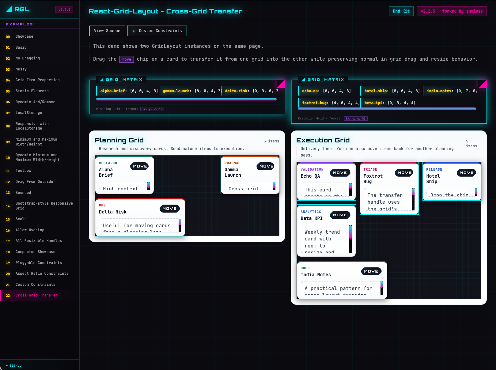

# React-Grid-Layout ==> Forked

- See original [README-origin.md](README-origin.md)
- [Forked repo
  ](https://github.com/sguisse/react-grid-layout)
- [DnD-kit samples](https://sguisse.github.io/react-grid-layout/examples/00-showcase.html)

## DND-kit migration & cross-grid drag-and-drop

This fork replaces the previous drag/resize implementation (react-draggable + react-resizable) with the @dnd-kit suite (v0.3.2) to enable native drag-and-drop transfers between different Grid instances (cross-grid DnD).

Fork based from :

```json
"name": "react-grid-layout",
"version": "2.2.3",
```

## Why we want to add cross-grid DnD support

**React-Grid-Layout** remains the premier choice for building responsive grids in React. Its robust architecture is the perfect foundation for complex layouts, though users have often sought a way to move items between separate grid instances—a feature known as **cross-grid drag-and-drop**.

Recognizing this as a key requirement for multi-section dashboards and a long-standing request within the community, I have extended the library to include native support for cross-grid interactions. This fork aims to provide that missing piece while staying true to the original's excellent design:

- https://github.com/react-grid-layout/react-grid-layout/pull/1462
- https://github.com/react-grid-layout/react-grid-layout/discussions/2078#discussioncomment-15990728

## Why use Dnd-Kit

- @dnd-kit provides composable primitives for drag/drop and collision detection that make it possible to move items between separate droppable containers.
- Enables cross-grid transfers (drag item from Grid A and drop into Grid B) which was not feasible with the old libraries.
- Modern, actively maintained, and flexible for custom behaviors.

## What changed

- Internal drag and resize handling now uses the following packages (already added as dependencies in this fork):
  - `@dnd-kit/react` (v0.3.2)
  - `@dnd-kit/dom` (v0.3.2)
  - `@dnd-kit/collision` (v0.3.2)
  - `@dnd-kit/abstract` (v0.3.2)
- The older `react-draggable` / `react-resizable` primitives were removed from the grid internals in favor of DND-kit primitives and custom positioning/collision strategies.
- A little bit of source code, ...

## How I have done the migration

- After trying several different approaches, I finally achieved a successful migration by building a dedicated team of AI agents and custom skills to handle the heavy lifting.
  - The most challenging part was engineering the specific instructions needed to structure the team effectively.
  - I’ve left the implementation details in the `tools` folder if you’d like to explore them
  - Just keep in mind that the current version isn't quite 'plug-and-play' for repeated runs yet!

## Demo / sample

A new example demonstrates cross-grid transfers and is included under:

- `test/examples/22-cross-grid-transfer.jsx`

This example shows two independent grids where items can be dragged from one grid and dropped into the other. Use it to verify cross-grid behavior and to experiment with interactions.

## How to run the sample (recommended: yarn)

1. Install dependencies:

```bash
cd /Users/mac-SGUISS21/01-work/01-projects/02-web/fork/react-grid-layout
yarn
```

2. Generate the static example pages and view them:

```bash
yarn view-example   # runs the example generator and serves the examples
# or
make build-example  # build + generate example HTML
```

3. Open the example in your browser:

```
http://localhost:4002/react-grid-layout/examples/22-cross-grid-transfer.html
```

## What to look for

- Drag an item from the left grid and drop it onto the right grid (and vice-versa).
- The example preserves item size and updates layouts on drop.
- Resize behavior is managed via the DND-kit integration.

## Notes for contributors

- The public Grid API remains mostly compatible, but internals and event flows changed — if you implement custom grid children, ensure they forward refs and standard event props (`style`, `className`, `onMouseDown`, `onMouseUp`, `onTouchEnd`).
- The repository recommends using `yarn` to avoid npm peer-dependency resolution differences.

## Sample

[DnD-kit samples](https://sguisse.github.io/react-grid-layout/examples/00-showcase.html)



## Migration Status

- 🚧 Non Regression Testing still in progress ... 🚧
  - Continue to Review AI generated Code. I have push this version **seems** to be already "usable"
