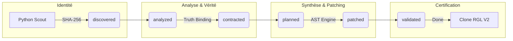

# 💎 RGL V7 COMMAND CENTER

## 🚥 Chaîne d'Assemblage Déterministe

## 📊 Registre d'Exécution (State Machine)

<!-- REGISTRY_TABLE_START -->

**Progression Globale : [████░░░░░░░░░░░░] 25% (19/77 fichiers)**

| Fichier | État | Retries | Dernière Erreur | Agent | Action |
| :--- | :---: | :---: | :--- | :---: | :---: |
| test/dev-hook.jsx | 📝 contracted | 0/3 | - | - | - |
| test/parity.spec.ts | ⏳ discovered | 0/3 | - | - | - |
| test/test-hook.jsx | 📝 contracted | 0/3 | - | - | - |
| test/util/deepFreeze.js | 📝 contracted | 0/3 | - | - | - |
| test/util/setupTests.js | 📝 contracted | 0/3 | - | - | - |
| test/spec/margin-consistency.test.ts | 📝 contracted | 0/3 | - | - | - |
| test/spec/utils-test.js | 📝 contracted | 0/3 | - | - | - |
| test/spec/compactors-test.ts | 📝 contracted | 0/3 | - | - | - |
| test/spec/hooks-test.tsx | 📝 contracted | 0/3 | - | - | - |
| test/spec/backcompat-test.js | 📝 contracted | 0/3 | - | - | - |
| test/spec/static-compaction.test.ts | 📝 contracted | 0/3 | - | - | - |
| test/spec/drop-alignment.test.ts | 📝 contracted | 0/3 | - | - | - |
| test/spec/constraints-test.ts | 📝 contracted | 0/3 | - | - | - |
| test/spec/wrapCompactor-test.ts | 📝 contracted | 0/3 | - | - | - |
| test/spec/typescript-components-test.tsx | ✅ done | 0/3 | - | - | - |
| test/spec/benchmark-test.js | 📝 contracted | 0/3 | - | - | - |
| test/spec/resize-constraints-test.tsx | ✅ done | 0/3 | - | - | - |
| test/spec/fast-horizontal-compactor-test.js | 📝 contracted | 0/3 | - | - | - |
| test/spec/responsive-dnd-test.tsx | ✅ done | 0/3 | - | - | - |
| test/spec/core-functions-test.ts | 📝 contracted | 0/3 | - | - | - |
| test/spec/lifecycle-test.js | ✅ done | 0/3 | - | - | - |
| test/spec/fast-compactor-test.js | 📝 contracted | 0/3 | - | - | - |
| test/examples/19-constraints.jsx | 📝 contracted | 0/3 | - | - | - |
| test/examples/20-aspect-ratio.jsx | 📝 contracted | 0/3 | - | - | - |
| test/examples/16-allow-overlap.jsx | 📝 contracted | 0/3 | - | - | - |
| test/examples/01-basic.jsx | 📝 contracted | 0/3 | - | - | - |
| test/examples/06-dynamic-add-remove.jsx | 📝 contracted | 0/3 | - | - | - |
| test/examples/09-min-max-wh.jsx | 📝 contracted | 0/3 | - | - | - |
| test/examples/07-localstorage.jsx | 📝 contracted | 0/3 | - | - | - |
| test/examples/08-localstorage-responsive.jsx | 📝 contracted | 0/3 | - | - | - |
| test/examples/11-toolbox.jsx | 📝 contracted | 0/3 | - | - | - |
| test/examples/14-responsive-bootstrap-style.jsx | 📝 contracted | 0/3 | - | - | - |
| test/examples/18-compactors.jsx | 📝 contracted | 0/3 | - | - | - |
| test/examples/04-grid-property.jsx | 📝 contracted | 0/3 | - | - | - |
| test/examples/17-resizable-handles.jsx | 📝 contracted | 0/3 | - | - | - |
| test/examples/12-drag-from-outside.jsx | 📝 contracted | 0/3 | - | - | - |
| test/examples/test_demo.jsx | 📝 contracted | 0/3 | - | - | - |
| test/examples/13-bounded.jsx | 📝 contracted | 0/3 | - | - | - |
| test/examples/03-messy.jsx | 📝 contracted | 0/3 | - | - | - |
| test/examples/21-custom-constraints.jsx | 📝 contracted | 0/3 | - | - | - |
| test/examples/05-static-elements.jsx | 📝 contracted | 0/3 | - | - | - |
| test/examples/10-dynamic-min-max-wh.jsx | 📝 contracted | 0/3 | - | - | - |
| test/examples/00-showcase.jsx | 📝 contracted | 0/3 | - | - | - |
| test/examples/15-scale.jsx | 📝 contracted | 0/3 | - | - | - |
| test/examples/02-no-dragging.jsx | 📝 contracted | 0/3 | - | - | - |
| src/index.ts | 📝 contracted | 0/3 | - | - | - |
| src/core/responsive.ts | ✅ done | 0/3 | - | - | - |
| src/core/constraints.ts | ✅ done | 0/3 | - | - | - |
| src/core/position.ts | ✅ done | 0/3 | - | - | - |
| src/core/compact-compat.ts | 📝 contracted | 0/3 | - | - | - |
| src/core/types.ts | ✅ done | 0/3 | - | - | - |
| src/core/collision.ts | ✅ done | 0/3 | - | - | - |
| src/core/sort.ts | 📝 contracted | 0/3 | - | - | - |
| src/core/layout.ts | ✅ done | 0/3 | - | - | - |
| src/core/calculate.ts | ✅ done | 0/3 | - | - | - |
| src/core/index.ts | 📝 contracted | 0/3 | - | - | - |
| src/core/compactors.ts | ✅ done | 0/3 | - | - | - |
| src/legacy/WidthProvider.tsx | 📝 contracted | 0/3 | - | - | - |
| src/legacy/ReactGridLayout.tsx | 📝 contracted | 0/3 | - | - | - |
| src/legacy/ResponsiveReactGridLayout.tsx | 📝 contracted | 0/3 | - | - | - |
| src/legacy/index.ts | 📝 contracted | 0/3 | - | - | - |
| src/react/index.ts | 📝 contracted | 0/3 | - | - | - |
| src/react/dnd/runtime.tsx | ✅ done | 0/3 | - | - | - |
| src/react/components/ResponsiveGridLayout.tsx | ✅ done | 0/3 | - | - | - |
| src/react/components/GridLayout.tsx | ✅ done | 0/3 | - | - | - |
| src/react/components/WidthProvider.tsx | 📝 contracted | 0/3 | - | - | - |
| src/react/components/index.ts | 📝 contracted | 0/3 | - | - | - |
| src/react/components/GridItem.tsx | ✅ done | 0/3 | - | - | - |
| src/react/hooks/useContainerWidth.ts | ✅ done | 0/3 | - | - | - |
| src/react/hooks/useResponsiveLayout.ts | ✅ done | 0/3 | - | - | - |
| src/react/hooks/useGridLayout.ts | ✅ done | 0/3 | - | - | - |
| src/react/hooks/index.ts | 📝 contracted | 0/3 | - | - | - |
| src/extras/fastHorizontalCompactor.ts | 📝 contracted | 0/3 | - | - | - |
| src/extras/index.ts | 📝 contracted | 0/3 | - | - | - |
| src/extras/fastVerticalCompactor.ts | 📝 contracted | 0/3 | - | - | - |
| src/extras/GridBackground.tsx | 📝 contracted | 0/3 | - | - | - |
| src/extras/wrapCompactor.ts | 📝 contracted | 0/3 | - | - | - |

<!-- REGISTRY_TABLE_END -->
