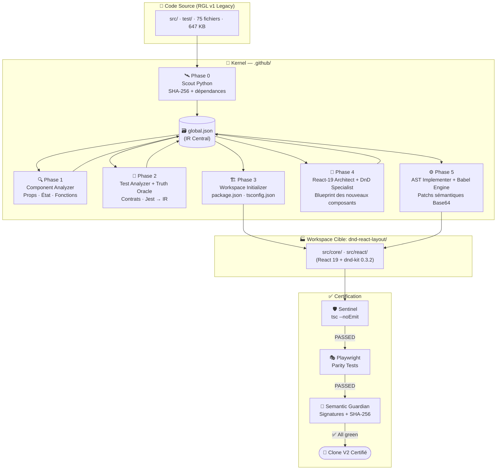
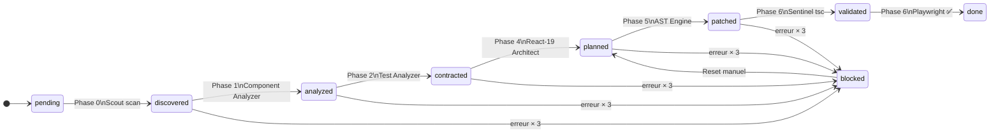
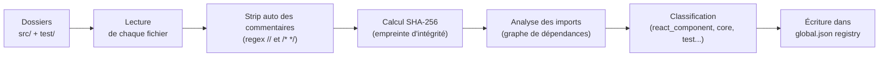
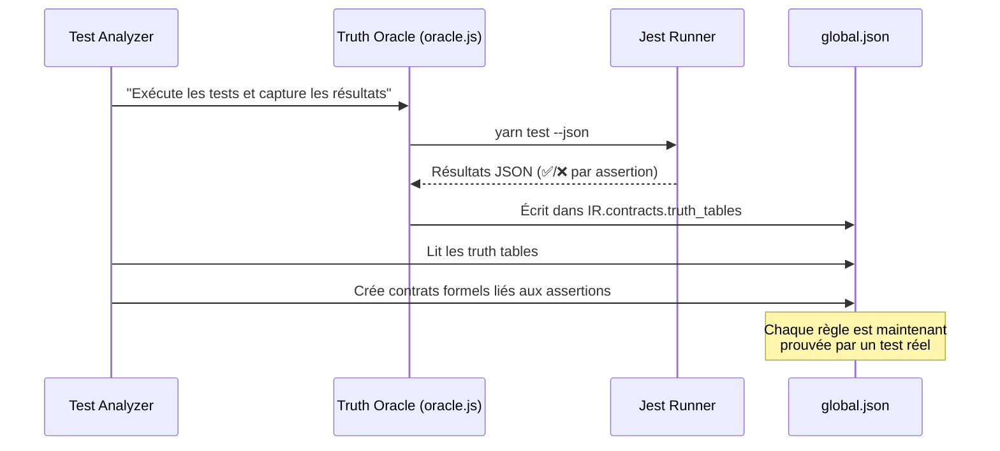
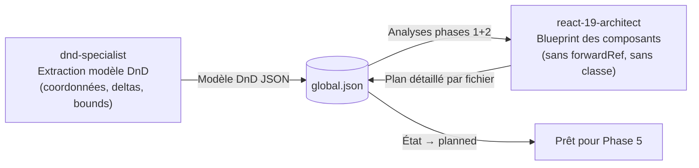
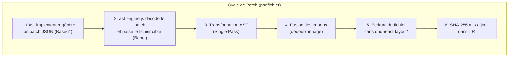
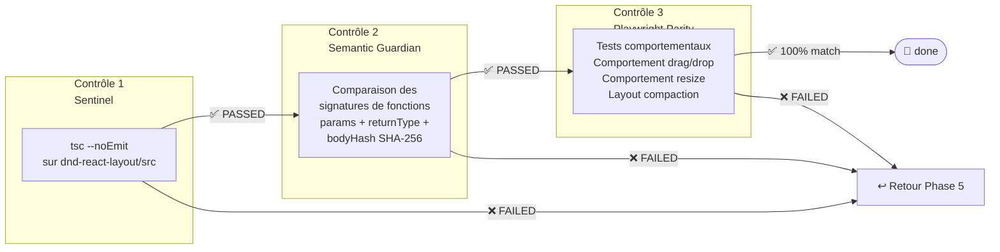
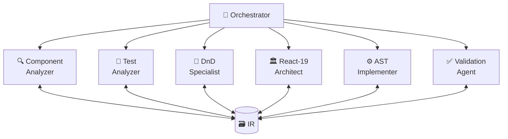
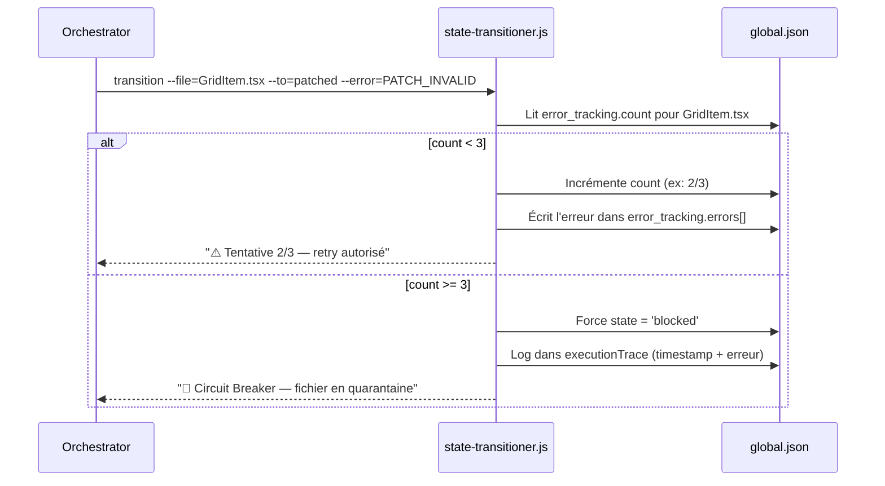
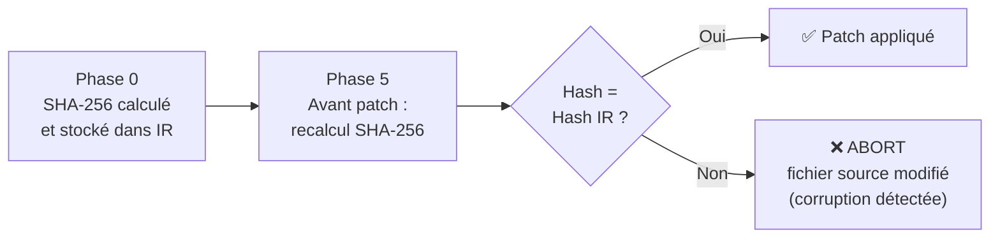

# 🏗️ Architecture Platform V7.26 — Industrial Agentic Compiler

> **Document de référence technique.** Il décrit comment chaque composant du système fonctionne, comment ils communiquent, et pourquoi chaque choix de conception a été fait.

---

## 📋 Table des matières

1. [Vision Globale](#1-vision-globale--lusine-de-code)
2. [L'IR — Mémoire Centrale](#2-lir--mémoire-centrale-globaljson)
3. [Les Phases du Pipeline](#3-les-phases-du-pipeline)
4. [Les Agents Spécialisés](#4-les-agents-spécialisés)
5. [Les Skills (Scripts bas niveau)](#5-les-skills-scripts-bas-niveau)
6. [Sécurité & Résilience](#6-sécurité--résilience)
7. [Glossaire Technique](#7-glossaire-technique)

---

## 1. Vision Globale — L'Usine de Code

Le système fonctionne comme une **ligne d'assemblage automatisée**. Chaque phase transforme le code d'un état à un autre, de manière déterministe et traçable.



### Principe fondamental : l'isolation totale

```
┌──────────────────────────────────────────────┐
│  Code source original  (react-grid-layout/)  │  ← JAMAIS modifié
│  Analyses & contrats   (.github/IR/)         │  ← Lecture/Écriture
│  Code généré           (dnd-react-layout/)   │  ← Écriture exclusivement
└──────────────────────────────────────────────┘
```

---

## 2. L'IR — Mémoire Centrale (`global.json`)

L'**Intermediate Representation** (IR) est le seul fichier qui connaît l'état complet du système. Tous les agents le lisent et y écrivent.

### Structure du fichier

```json
{
  "metadata": {
    "version": "v7.0",
    "created": "2026-01-01T00:00:00Z"
  },
  "stateMachine": {
    "states": ["pending", "discovered", "analyzed", "contracted",
               "planned", "patched", "validated", "done", "blocked"],
    "allowedTransitions": {
      "discovered": ["analyzed"],
      "analyzed":   ["contracted"],
      "contracted": ["planned"],
      "planned":    ["patched"],
      "patched":    ["validated"],
      "validated":  ["done"]
    }
  },
  "registry": {
    "files": {
      "src/react/components/GridLayout.tsx": {
        "state": "contracted",
        "sha256": "a3f9c2...",
        "classification": "react_component",
        "error_tracking": { "count": 0, "errors": [] },
        "analysis": { ... },
        "contracts": { ... }
      }
    },
    "cleaned_snapshots": {}
  },
  "contracts": {
    "truth_tables": []
  },
  "executionTrace": [],
  "progress": { "globalPercentage": 42 }
}
```

### La machine d'états



### Classifications des fichiers

Le Scout Python classe chaque fichier détecté :

| Classification | Chemin typique | Traitement |
|---|---|---|
| `react_component` | `src/react/components/*.tsx` | Analyse complète + migration |
| `core` | `src/core/*.ts` | Extraction fonctions pures |
| `test` | `test/spec/*.ts` | Truth Oracle binding |
| `example` | `test/examples/*.jsx` | Génération parity tests |
| `legacy` | `src/legacy/*.tsx` | Analyse uniquement (pas de migration) |
| `extra` | `src/extras/*.ts` | Optionnel |

---

## 3. Les Phases du Pipeline

### Phase 0 — Scout Déterministe (`scout.py`)

**Rôle** : Cartographier 100% du code source avant de toucher quoi que ce soit.

**Comment ça marche** :



**Pourquoi le SHA-256 ?** Si un fichier source est modifié accidentellement pendant la migration, le hash ne correspond plus et le système le détecte immédiatement.

**Commande** :
```bash
python3 .github/skills/pre-processor-scout/scout.py
```

---

### Phase 1 — Component Analyzer

**Rôle** : Comprendre en profondeur chaque composant React legacy.

**Ce qui est extrait** :
- Toutes les **props** (nom, type, valeur par défaut, obligatoire ?)
- La séparation **état logique** / **état d'affichage**
- Les **fonctions pures** et leurs signatures exactes
- Les **anti-patterns React legacy** : `findDOMNode`, composants classe, `lifecycle` hooks obsolètes
- Les **dépendances étrangères** : `react-draggable`, `react-resizable`

**Stockage dans l'IR** :
```json
"src/react/components/GridItem.tsx": {
  "analysis": {
    "props": ["x", "y", "w", "h", "isDraggable", "isResizable"],
    "state": ["dragging", "resizing"],
    "pureFunctions": ["calcGridColWidth", "calcXY"],
    "legacyPatterns": ["forwardRef required"],
    "externalDeps": ["react-draggable", "react-resizable"]
  }
}
```

---

### Phase 2 — Test Analyzer + Truth Oracle

**Rôle** : Extraire les règles comportementales immuables depuis les tests existants.



**Exemple de contrat généré** :
```json
{
  "rule": "Un item avec static:true ne peut pas être déplacé",
  "oracle_reference": "test/spec/core-functions-test.ts#L142",
  "assertion": "PASSED",
  "linked_function": "moveElement()"
}
```

---

### Phase 3 — Workspace Initializer (Auto-Genesis)

**Rôle** : Créer l'environnement de construction propre et isolé **avant** de générer du code.

**Principe : on ne bâtit JAMAIS sur des fondations inconnues.**

```
dnd-react-layout/
├── package.json          ← Versions VERROUILLÉES
│   ├── react: ^19.0.0
│   ├── @dnd-kit/core: 0.3.2    ← Version exacte
│   └── typescript: ^5.0.0
├── tsconfig.json         ← strict: true, moduleResolution: bundler
└── src/
    ├── core/             ← Fonctions pures (zéro dépendance React)
    └── react/
        ├── components/
        └── hooks/
```

**Pourquoi verrouiller dnd-kit sur 0.3.2 ?** L'API de dnd-kit a changé entre 0.3.x et les versions ultérieures. Le modèle mathématique de DnD extrait par le `dnd-specialist` est calibré sur 0.3.2 exactement.

---

### Phase 4 — React-19 Architect + DnD Specialist

**Rôle** : Produire un blueprint de migration avant d'écrire une seule ligne.

Le `dnd-specialist` extrait d'abord le **modèle mathématique complet** du système DnD actuel (coordonnées, deltas, contraintes), puis le `react-19-architect` conçoit les nouveaux composants en suivant les règles React 19 :



**Règles React 19 appliquées** :
- ❌ Pas de `forwardRef()` — les refs sont des props directes en React 19
- ❌ Pas de composants classe
- ✅ Hooks uniquement (`useDraggable`, `useDroppable` de dnd-kit)
- ✅ Séparation stricte `core/` (logique pure, testable sans browser) / `react/` (composants)

---

### Phase 5 — Turbo-Kernel AST (Babel Engine)

**Rôle** : Transcrire le blueprint en vrais fichiers de code, de manière 100% déterministe.



**Pourquoi Base64 ?** Les patches contiennent du code source avec des guillemets, backticks, et caractères spéciaux. L'encodage Base64 garantit un transport sans corruption, peu importe la complexité du code patché.

**Single-Pass expliqué** : Au lieu d'appeler Babel une fois par modification (lent), le moteur lit l'arbre AST une seule fois et applique **toutes** les transformations en un seul parcours. Résultat : 10× plus rapide pour les gros fichiers.

**Exemple de patch JSON** :
```json
{
  "targetFile": "src/react/components/GridItem.tsx",
  "patches": [
    {
      "type": "REPLACE_FUNCTION",
      "functionName": "calcPosition",
      "payload": "Y29uc3QgY2FsY1Bvc2l0aW9uID0gKC4uLik..."
    },
    {
      "type": "ADD_IMPORT",
      "source": "@dnd-kit/core",
      "specifiers": ["useDraggable"]
    }
  ]
}
```

---

### Phase 6 — Validation & Certification (Triple Contrôle)

**Rôle** : Garantir que le clone est **sémantiquement et comportementalement** identique à l'original.



**Ce que vérifie le Semantic Guardian** :
- Les `params` de chaque fonction transformée correspondent à l'original
- Le `returnType` TypeScript inchangé
- Le `bodyHash` (SHA-256 du corps de fonction) pour détecter les mutations de logique non voulues
- Support des 3 types : `FunctionDeclaration`, fonctions fléchées (`const f = () =>`), méthodes de classe

---

## 4. Les Agents Spécialisés

| Agent | Rôle principal | Outils autorisés | Phase(s) |
|---|---|---|---|
| `orchestrator` | Chef d'orchestre, pilote tous les autres | read, search, edit, shell, agent, todo | Toutes |
| `component-analyzer` | Analyse AST des composants React | read, search | 1 |
| `test-analyzer` | Extrait les contrats comportementaux | read, search | 2 |
| `dnd-specialist` | Modélise mathématiquement le système DnD | read, search | 4 |
| `react-19-architect` | Planifie l'architecture React 19 cible | read, search, edit, shell | 4 |
| `ast-implementer` | Génère les patchs Babel sémantiques | read, search, shell | 5 |
| `validation-agent` | Génère et lance les tests de parité Playwright | read, search, shell | 6 |



---

## 5. Les Skills (Scripts bas niveau)

Les skills sont des scripts Node.js/Python que les agents invoquent directement. Chaque skill a une **responsabilité unique**.

| Skill | Langage | Responsabilité |
|---|---|---|
| `pre-processor-scout` | Python | Scan + SHA-256 + graphe dépendances |
| `ast-execution` | Node.js | Moteur Babel (exécute les patches) |
| `state-transitioner` | Node.js | Transitions d'état IR + Circuit Breaker |
| `truth-oracle` | Node.js | Exécute Jest + capture résultats |
| `semantic-guardian` | Node.js | Vérifie parité sémantique fonctions |
| `forensic-scalpel` | Node.js | Extrait fonctions précises via AST |
| `type-flattener` | Node.js | Extrait types TS (interface/type/enum) |
| `context-cleaner` | Node.js | Snapshot nettoyé (commentaires retirés) |
| `workspace-initializer` | Node.js | Crée dnd-react-layout/ + configs |
| `ci-pipeline` | Node.js | Sentinel : lance tsc --noEmit |
| `test-runner` | Node.js | Execute les tests Playwright parity |
| `data-injector` | Node.js | Sauvegarde analyses JSON dans l'IR |
| `file-writer` | Node.js | Écrit fichiers dans le workspace cible |
| `heartbeat` | Node.js | Signal vital (live-status.json) |

---

## 6. Sécurité & Résilience

### 6.1 Le Circuit Breaker

Empêche les boucles infinites d'hallucination IA sur un fichier en échec.



### 6.2 L'Intégrité par Hash



### 6.3 L'Isolation du Contexte LLM

Pour minimiser les hallucinations, le système réduit la fenêtre de contexte envoyée au LLM :

| Technique | Skill | Réduction typique |
|---|---|---|
| Strip commentaires | `context-cleaner` | ~20% |
| Extraction types seuls | `type-flattener` | ~60% |
| Extraction fonction seule | `forensic-scalpel` | ~80% |
| Encodage Base64 patch | `ast-implementer` | Format stable |

---

## 7. Glossaire Technique

| Terme | Définition |
|---|---|
| **AST** | *Abstract Syntax Tree* — Représentation logique en arbre du code source. Babel parse le code TypeScript en AST, le modifie, puis le re-génère en texte. |
| **IR** | *Intermediate Representation* — Fichier `global.json` qui centralise tout l'état de la migration. |
| **Single-Pass** | Technique où l'arbre AST est parcouru une seule fois pour appliquer toutes les modifications. Plus rapide qu'un passage par modification. |
| **Base64** | Encodage qui permet de transporter du code source (avec tous ses caractères spéciaux) sans corruption à travers des frontières de protocole. |
| **Sentinel** | Le script `tsc --noEmit` qui vérifie la cohérence sémantique TypeScript sans produire de fichiers de sortie. |
| **Truth Oracle** | Exécution des vraies suites Jest pour capturer les résultats comme "vérité de référence" immuable. |
| **Circuit Breaker** | Mécanisme qui bloque un fichier après 3 erreurs consécutives pour éviter les boucles infinies. |
| **Parity Test** | Test Playwright qui compare le comportement du composant V2 avec le composant V1 original — ils doivent être identiques. |
| **Greenfield Workspace** | Dossier `dnd-react-layout/` créé from scratch, sans aucun héritage du code legacy. |
| **SHA-256** | Algorithme de hachage cryptographique. Un fichier = un hash unique. Si le fichier change, le hash change — détection de modification garantie. |
