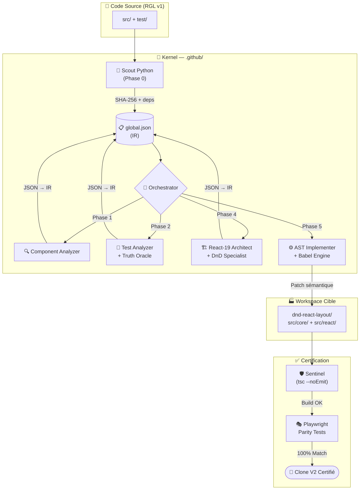

# 🔥 Industrial Agentic Compiler — Plateforme de Migration React

> **TL;DR** : Cette plateforme automatise la migration de `react-grid-layout` vers **React 19 + dnd-kit v0.3.2** grâce à un pipeline d'agents IA orchestrés, un moteur AST Babel et un système de validation sémantique.

---

## 📑 Table des matières

1. [À quoi ça sert ?](#-à-quoi-ça-sert)
2. [Les 4 Piliers](#-les-4-piliers)
3. [Les Systèmes de Sécurité](#️-les-systèmes-de-sécurité)
4. [Architecture en un coup d'œil](#-architecture-en-un-coup-dœil)
5. [Démarrage rapide](#-démarrage-rapide)
6. [Fichiers & Répertoires](#-fichiers--répertoires)

---

## 🎯 À quoi ça sert ?

Au lieu de réécrire manuellement des milliers de lignes de code (risque d'erreurs, oublis, régressions), cette plateforme utilise des **agents IA spécialisés** et des **scripts déterministes** pour garantir que le nouveau code se comporte **exactement** comme l'ancien.

| Aspect | Approche Manuelle | Cette Plateforme |
|---|---|---|
| Temps | Semaines | Heures |
| Risque de régression | Élevé | Très faible (validation automatique) |
| Traçabilité | Documentation manuelle | `executionTrace` automatique |
| Vérification | Tests manuels | Playwright parity tests automatisés |

---

## 🏗️ Les 4 Piliers

### 1. 🧠 Le Cerveau Central — L'IR (`global.json`)

Tout le système partage une **mémoire unique** : le fichier `global.json` (Intermediate Representation). Il sait à tout moment où en est chaque fichier.

```
pending → discovered → analyzed → contracted → planned → patched → validated → done
                                                                          ↘ blocked (quarantaine)
```

### 2. 🏭 L'Usine Propre — Isolation du Workspace

Le nouveau code est généré dans un dossier **entièrement séparé** (`dnd-react-layout/`). Le code source original n'est jamais modifié.

### 3. 🔬 Le Scalpel — Turbo-Kernel AST

Au lieu de chercher/remplacer du texte, le moteur **Babel AST** lit la structure logique du code (son "arbre") et effectue des remplacements chirurgicaux :
- Remplacement de fonctions entières
- Fusion intelligente d'imports (pas de doublons)
- Préservation des exports publics

### 4. 🛡️ Le Garde-Barrière — La Sentinelle

Après chaque transformation, le compilateur TypeScript (`tsc --noEmit`) vérifie que le code généré est **sémantiquement valide** (pas de variable manquante, pas d'erreur de type).

---

## 🛡️ Les Systèmes de Sécurité

| Système | Rôle | Déclenchement |
|---|---|---|
| **Circuit Breaker** | Bloque un fichier après 3 échecs consécutifs | Automatique |
| **Heartbeat** | Prouve que l'agent est vivant (pas planté) | Toutes les étapes longues |
| **Hash SHA-256** | Détecte toute modification non autorisée du source | À chaque opération |
| **Base64** | Transport de code sans corruption caractères spéciaux | Tous les patchs AST |

---

## 🗺️ Architecture en un coup d'œil



---

## 🚀 Démarrage rapide

### Prérequis

```bash
# 1. Installer les dépendances du moteur AST
yarn add --dev @babel/parser @babel/traverse @babel/generator @babel/types

# 2. Vérifier que python3 est disponible
python3 --version
```

### Lancer la migration complète

```
# Dans Copilot CLI, donnez ces instructions à l'Orchestrateur :

> "Phase 0 : lance le pre-processor-scout"
> "Phases 1 & 2 : analyse des composants et extraction des contrats"
> "Phase 3 : initialise le workspace dnd-react-layout"
> "Phase 4 : planifie l'architecture avec react-19-architect"
> "Phase 5 : applique les patchs AST"
> "Phase 6 : valide et certifie"
```

### Suivre l'avancement

```bash
# Tableau de bord en temps réel
cat .github/Memories/MIGRATION_TRACKER.md

# Preuve de vie de l'agent
cat .github/IR/live-status.json

# Journal complet
tail -f .github/IR/heartbeat.log
```

---

## 📁 Fichiers & Répertoires

```
.github/
├── 📋 README.md              ← Vous êtes ici
├── 📖 user-guide.md          ← Guide opérateur pas-à-pas
├── 🏗️  architecture.md       ← Documentation technique détaillée
├── agents/                   ← Définitions des agents IA
│   ├── orchestrator.md       ← Chef d'orchestre
│   ├── component-analyzer.md ← Analyse les composants React
│   ├── dnd-specialist.md     ← Extrait le modèle DnD
│   ├── react-19-architect.md ← Conçoit l'architecture cible
│   ├── test-analyzer.md      ← Extrait les contrats de test
│   ├── ast-implementer.md    ← Génère les patchs AST
│   └── validation-agent.md   ← Génère les tests de parité
├── skills/                   ← Scripts exécutables bas niveau
│   ├── pre-processor-scout/  ← Scan Python (Phase 0)
│   ├── ast-execution/        ← Moteur Babel
│   ├── state-transitioner/   ← Machine d'état IR
│   ├── truth-oracle/         ← Exécute Jest + capture résultats
│   ├── semantic-guardian/    ← Vérifie la parité sémantique
│   ├── ci-pipeline/          ← Sentinel TypeScript
│   ├── heartbeat/            ← Monitoring temps réel
│   ├── data-injector/        ← Sauvegarde JSON dans l'IR
│   ├── file-writer/          ← Écrit les fichiers générés
│   ├── workspace-initializer/← Crée dnd-react-layout
│   ├── forensic-scalpel/     ← Extrait les fonctions AST
│   ├── type-flattener/       ← Extrait les types TypeScript
│   ├── context-cleaner/      ← Nettoie le code pour le contexte
│   └── test-runner/          ← Lance les tests Playwright
├── IR/
│   ├── global.json           ← La mémoire centrale du système
│   ├── live-status.json      ← Statut temps réel (heartbeat)
│   ├── heartbeat.log         ← Journal d'activité historique
│   └── snapshots/            ← Types TypeScript extraits
└── Memories/
    └── MIGRATION_TRACKER.md  ← Tableau de bord visuel
```

**Conseil pour le nouveau venu :** Commencez par lire le [user-guide.md](user-guide.md) pour les instructions pas-à-pas, puis [architecture.md](architecture.md) pour la documentation technique complète.
