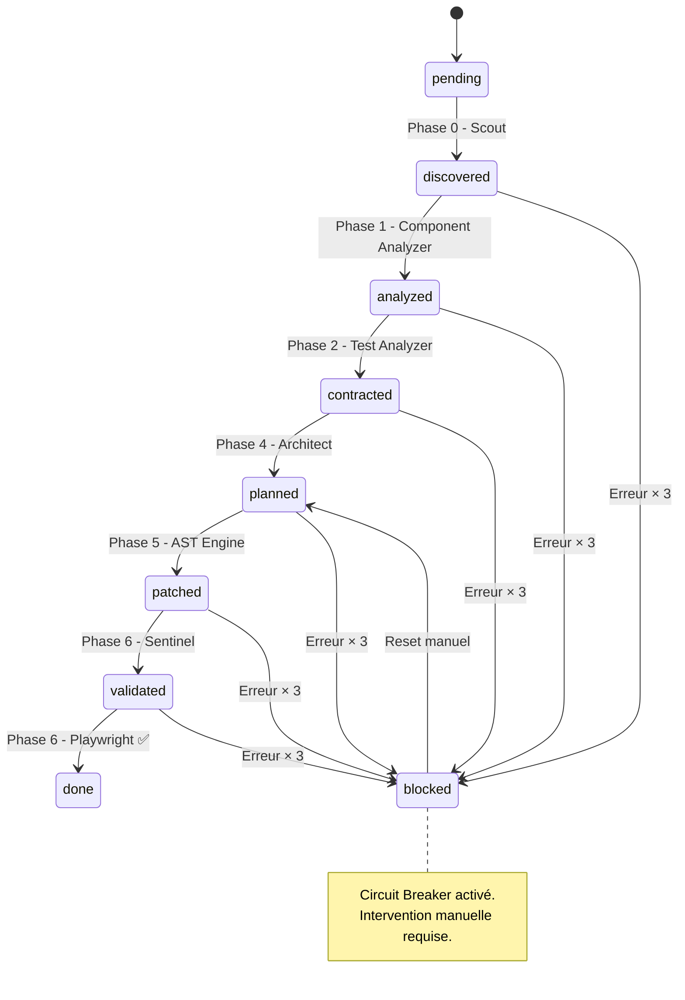
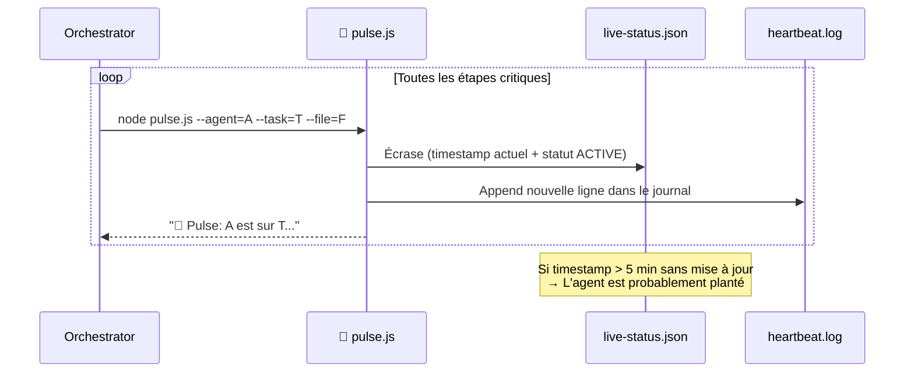
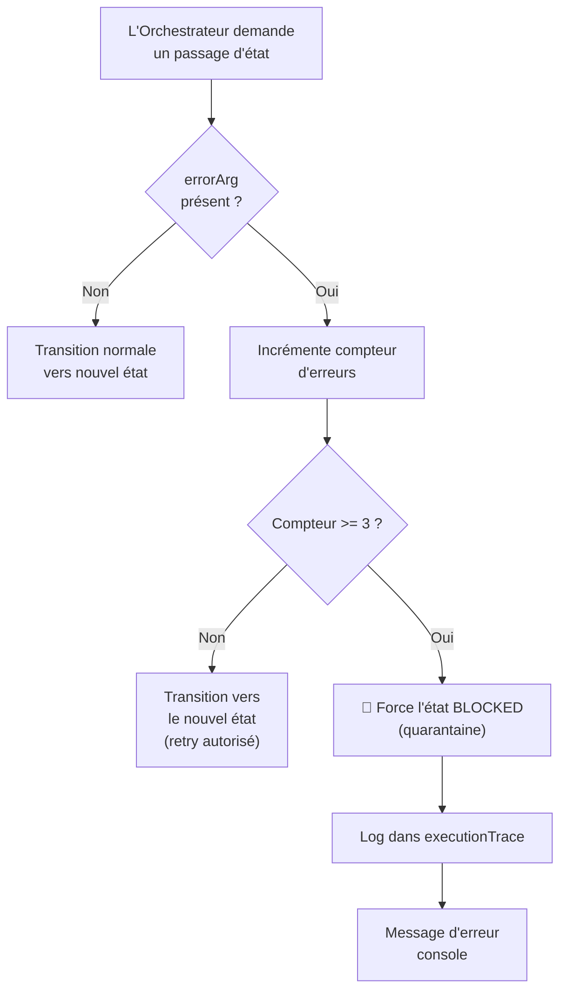
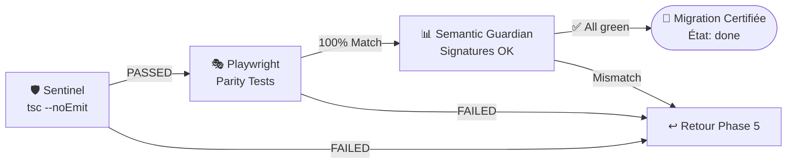

# 📖 User Guide V7.26 — Piloter la Migration RGL

> **Pour qui ?** Ce guide s'adresse à l'opérateur qui pilote le Kernel V7 en interagissant avec **GitHub Copilot CLI** (`copilot`). Aucune connaissance préalable du code source n'est nécessaire — l'IA s'occupe de tout, vous supervisez.

---

## 📑 Table des matières

1. [Préparation](#️-1-préparation-de-la-station-de-travail)
2. [Protocole de lancement](#-2-protocole-de-lancement-phase-par-phase)
3. [Surveillance & Tableaux de bord](#-3-surveillance-et-tableaux-de-bord)
4. [Dépannage](#-4-dépannage-circuit-breaker)
5. [Validation finale](#-5-validation-finale)

---

---

## 🛠️ 1. Préparation de la Station de Travail

### Prérequis logiciels

| Outil | Version min. | Vérification |
|---|---|---|
| Node.js | 18+ | `node --version` |
| Python | 3.8+ | `python3 --version` |
| Yarn | 1.22+ | `yarn --version` |
| GitHub Copilot CLI | latest | `copilot --version` |

### Installation des dépendances du moteur AST

```bash
yarn add --dev @babel/parser @babel/traverse @babel/generator @babel/types
```

> ⚠️ **Important** : Ce projet utilise `yarn` exclusivement. N'utilisez pas `npm install`.

### Vérification de la structure

Assurez-vous que ces dossiers sont présents à la racine du projet :

```
.github/
├── IR/         ← Le cerveau JSON (doit contenir global.json)
├── agents/     ← Les sous-agents spécialisés (7 fichiers .md)
└── skills/     ← Les scripts de bas niveau (14 dossiers)
```

Si `global.json` est absent, créez-le depuis le template minimal :

```bash
node -e "require('fs').writeFileSync('.github/IR/global.json', JSON.stringify({metadata:{version:'v7.0'},stateMachine:{states:[],allowedTransitions:{}},registry:{files:{}},progress:{globalPercentage:0}}, null, 2))"
```

---

## 🚀 2. Protocole de Lancement (Phase par Phase)

Voici la séquence complète. Chaque instruction est à taper dans le **terminal Copilot CLI** (`copilot`).

```mermaid
gantt
    title Pipeline de Migration — Vue d'ensemble
    dateFormat X
    axisFormat Phase %s
    section Reconnaissance
    Phase 0 - Cartographie         :done, p0, 0, 1
    section Analyse
    Phase 1 - Composants           :active, p1, 1, 2
    Phase 2 - Contrats & Tests     :p2, 2, 3
    section Construction
    Phase 3 - Workspace            :p3, 3, 4
    Phase 4 - Architecture         :p4, 4, 5
    section Transformation
    Phase 5 - Patching AST         :crit, p5, 5, 6
    section Certification
    Phase 6 - Validation           :p6, 6, 7
```



---

### 🛰️ Phase 0 — Cartographie (Reconnaissance)

**Ce qui se passe** : Le Scout Python (`scout.py`) parcourt tous les fichiers source, calcule leur empreinte SHA-256 et construit le graphe de dépendances. Chaque fichier est enregistré dans l'IR à l'état `discovered`.

**Instruction à donner** :
> *"Utilise l'agent `orchestrator`. Initialise la Phase 0 : lance le `pre-processor-scout` pour mapper les dépendances dans l'IR."*

**Vérification** :
```bash
# Compter les fichiers découverts
node -e "const ir=require('./.github/IR/global.json'); console.log('Fichiers découverts:', Object.keys(ir.registry.files).length)"
```

**État IR attendu** : tous les fichiers à `discovered` ✅

---

### 🔍 Phase 1 — Analyse des Composants

**Ce qui se passe** : L'agent `component-analyzer` inspecte chaque composant React et extrait :
- La liste exhaustive des props
- La séparation état logique / état visuel
- Les fonctions pures et leurs signatures exactes
- Les anti-patterns (lifecycle legacy, `findDOMNode`, etc.)

**Instruction à donner** :
> *"Phase 1 : utilise le `component-analyzer` pour analyser les composants découverts. Commence par `src/react/components/GridLayout.tsx` et `src/react/components/GridItem.tsx`. Sauvegarde les résultats dans l'IR via le `data-injector`."*

> *"Phase 1 (suite) : continue l'analyse avec le `component-analyzer` sur les fichiers restants : `ResponsiveGridLayout.tsx`, `WidthProvider.tsx`, `useGridLayout.ts`, `useResponsiveLayout.ts`, `useContainerWidth.ts`. Sauvegarde chaque résultat dans l'IR via le `data-injector`. Ne passe pas à Phase 2 avant que tous ces fichiers soient à l'état
`analyzed`."*


**État IR attendu** : fichiers analysés à `analyzed` ✅

---

### 📝 Phase 2 — Extraction des Contrats (Truth Binding)

**Ce qui se passe** :
1. Le `truth-oracle` exécute les tests Jest originaux et capture les résultats dans `IR.contracts.truth_tables`
2. Le `test-analyzer` crée un contrat formel (props, callbacks, règles de layout) lié aux tests réels

**Instruction à donner** :
> *"Phase 2 : lance le `truth-oracle` pour capturer les résultats Jest, puis utilise le `test-analyzer` pour extraire les contrats comportementaux. Lie chaque règle à une assertion Oracle."*

**Vérification** :
```bash
# Voir les truth tables capturées
node -e "const ir=require('./.github/IR/global.json'); console.log('Tests capturés:', (ir.contracts?.truth_tables||[]).length)"
```

**État IR attendu** : fichiers à `contracted` ✅

---

### 🏗️ Phase 3 — Auto-Genesis (Workspace Isolé)

**Ce qui se passe** : Le script `workspace-initializer.js` crée le dossier `dnd-react-layout/` avec sa structure et ses fichiers de configuration pré-remplis (versions exactes bloquées).

**Instruction à donner** :
> *"Phase 3 : exécute le `workspace-initializer` pour créer le dossier `dnd-react-layout` avec `package.json` (React 19, dnd-kit 0.3.2) et `tsconfig.json`."*

**Résultat attendu** :
```
dnd-react-layout/
├── package.json     (react@^19.0.0, dnd-kit@0.3.2)
├── tsconfig.json
├── src/
│   ├── core/        (fonctions pures)
│   └── react/       (composants)
└── test/
```

---

### 📐 Phase 4 — Architecture Blueprint (Planification)

**Ce qui se passe** : L'agent `react-19-architect` lit toutes les analyses de l'IR et produit un plan détaillé indiquant quel fichier créer, sur quelle base, avec quelles transformations. L'agent `dnd-specialist` fournit le mapping DnD exact.

**Instruction à donner** :
> *"Phase 4 : utilise le `dnd-specialist` pour extraire le modèle mathématique DnD, puis le `react-19-architect` pour planifier la structure des nouveaux fichiers dans le workspace. Utilise les patterns React 19 (pas de forwardRef, pas de classe)."*

**État IR attendu** : fichiers à `planned` ✅

---

### ⚙️ Phase 5 — Turbo-Kernel AST (Chirurgie de Code)

**Ce qui se passe** : C'est l'étape **la plus longue et la plus critique**. L'agent `ast-implementer` génère des patchs JSON encodés en Base64, que le moteur Babel (`ast-engine.js`) applique chirurgicalement sur les fichiers.

> ⏱️ **Cette phase peut prendre 10 à 30 minutes** selon le nombre de fichiers. Activez le Heartbeat pour surveiller la progression.

**Instruction à donner** :
> *"Phase 5 : utilise l'`ast-implementer` pour générer les patchs sémantiques et applique-les avec le Turbo-Kernel AST. Active le Heartbeat toutes les minutes pour me tenir informé dans `live-status.json`."*

**Comment surveiller** :
```bash
# Dans un second terminal, surveiller le heartbeat en temps réel
watch -n 5 'cat .github/IR/live-status.json'
```

**État IR attendu** : fichiers à `patched` ✅

---

### ✅ Phase 6 — Validation & Certification

**Ce qui se passe** : Triple vérification automatique :
1. **Sentinel** (`tsc --noEmit`) — le code compile sans erreur
2. **Semantic Guardian** — les signatures de fonctions correspondent à l'original
3. **Playwright Parity** — le comportement interactif est identique

**Instruction à donner** :
> *"Phase 6 : exécute le `ci-pipeline` (Sentinel) pour le check TypeScript, puis génère et lance les tests de parité avec le `validation-agent` et le `test-runner`."*

**Résultat attendu** :
```json
{ "status": "PASSED", "logs": "Code V2 viable." }
```

**État IR attendu** : fichiers à `done` 🎉

---

### 💡 Vue d'ensemble du flux complet



---

## 🔍 3. Surveillance et Tableaux de Bord

### 3.1 Le Tracker de Progression

Le fichier `.github/Memories/MIGRATION_TRACKER.md` est votre tableau de bord principal :

```bash
cat .github/Memories/MIGRATION_TRACKER.md
```

Légende des icônes d'état :

| Icône | État | Signification |
|:---:|---|---|
| ⏳ | `pending` / `discovered` | En attente de traitement |
| 🔍 | `analyzed` | Analyse terminée |
| 📝 | `contracted` | Contrat extrait |
| 🏗️ | `planned` | Planifié, prêt pour le patch |
| 🛠️ | `patched` | Code modifié, en attente de validation |
| 🟢 | `validated` | Validé par Sentinel |
| ✅ | `done` | Migration terminée et certifiée |
| ❌ | `blocked` | Erreur × 3 — intervention manuelle requise |

### 3.2 Le Heartbeat (Preuve de Vie)

Pendant les phases longues (1, 2, 5), l'Orchestrateur envoie un signal vital toutes les minutes.



#### Lire le statut Live

```bash
# Photo instantanée
cat .github/IR/live-status.json
```

Exemple de contenu :
```json
{
  "timestamp": "2026-03-30T14:32:01.000Z",
  "agent": "ast-implementer",
  "current_task": "generating_base64_patch",
  "target_file": "src/react/components/GridItem.tsx",
  "status": "ACTIVE"
}
```

| Champ | Description |
|---|---|
| `timestamp` | Heure du dernier signe de vie |
| `agent` | L'agent actuellement actif (`component-analyzer`, `ast-implementer`, etc.) |
| `current_task` | L'action précise en cours (`parsing_ast_nodes`, `extracting_math`, etc.) |
| `target_file` | Le fichier en cours de traitement |
| `status` | Toujours `ACTIVE` si le script tourne |

#### Détecter un blocage

```bash
# Surveiller en temps réel (mise à jour toutes les 5 sec)
watch -n 5 'echo "=== LIVE STATUS ==="; cat .github/IR/live-status.json; echo ""; echo "=== DERNIÈRES LIGNES ==="; tail -5 .github/IR/heartbeat.log'
```

> 🚨 **Alerte** : Si `timestamp` n'a pas bougé depuis plus de **5 minutes**, le processus Node.js a probablement crashé.

---

## 🆘 4. Dépannage (Circuit Breaker)

### Comprendre le Circuit Breaker

Le Circuit Breaker empêche l'IA de boucler indéfiniment sur un fichier en échec.



### Que faire si un fichier est `blocked` ?

**Étape 1 — Identifier l'erreur** :
```bash
node -e "
  const ir = require('./.github/IR/global.json');
  const f = process.argv[1];
  const data = ir.registry.files[f];
  console.log('État:', data.state);
  console.log('Erreurs:', JSON.stringify(data.error_tracking, null, 2));
  const trace = (ir.executionTrace || []).filter(t => t.file === f).slice(-5);
  console.log('Trace récente:', JSON.stringify(trace, null, 2));
" src/MonFichier.ts
```

**Étape 2 — Corriger la cause** : Relisez le message d'erreur et affinez l'instruction à l'agent concerné. Exemple : si le `ast-implementer` hallucine un `nodeType` incorrect, précisez le type Babel exact dans votre prompt.

**Étape 3 — Réinitialiser l'état** :
```bash
# Remettre le fichier à 'planned' pour relancer le patch AST
node .github/skills/state-transitioner/transition.js \
  --file=src/react/components/GridItem.tsx \
  --to=planned
```

### Matrice de Dépannage Rapide

| Symptôme | Cause probable | Solution |
|---|---|---|
| `live-status.json` figé > 5 min | Crash Node.js / timeout API | Relancer la phase avec `--to=planned` |
| Fichier `blocked` après 3 retries | Patch AST invalide ou hallucination | Corriger le prompt de `ast-implementer` |
| `tsc` échoue en Phase 6 | Import manquant ou type incorrect | Vérifier le patch et relancer Phase 5 |
| `truth-oracle` retourne 0 tests | `yarn test` en erreur | Vérifier que `jest` est installé |
| Playwright tests échouent | Clone se comporte différemment | Analyser le diff, relancer Phase 5 sur les fichiers concernés |

---

## ✅ 5. Validation Finale (Sentinel & Parité)

### 5.1 La Sentinelle TypeScript

La Sentinelle vérifie que le code du workspace cible compile sans erreur :

```bash
node .github/skills/ci-pipeline/runner.js
```

Résultat attendu :
```json
{ "status": "PASSED", "logs": "Code V2 viable." }
```

En cas d'échec :
```json
{ "status": "FAILED", "error": "WORKSPACE_SEMANTIC_ERROR", "details": "..." }
```

### 5.2 Les Tests de Parité Playwright

Une fois la Sentinelle verte, les tests de parité confirment que le nouveau composant se **comporte exactement** comme l'original :

```bash
# Le test est généré puis exécuté automatiquement
node .github/skills/test-runner/runner.js --file=test/parity.spec.ts
```

### 5.3 Critères de Succès



> 💡 **Conseil** : Si les tests de parité échouent sur un seul composant, vous pouvez relancer uniquement la Phase 5 sur ce fichier spécifique plutôt que de tout recommencer.
